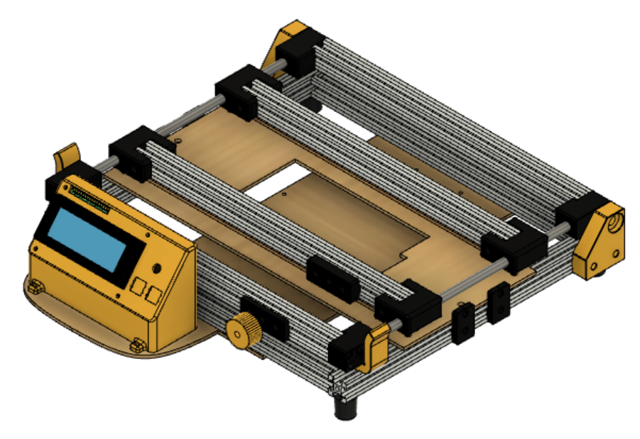
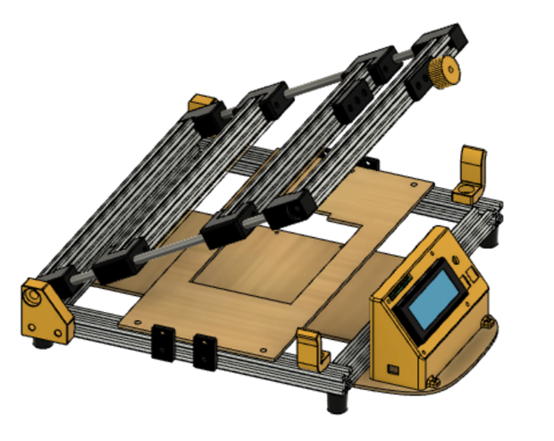

# Stencil printer

## About

The Stencil printer is modified from makermoekoe's Stencil-Jig. I add a heater bed mounting hole in the middle and a control panel in the front. Therefore, after mounting component on the PCBS, I can directly turn the heater bed on to solder them in place without moving PCBs around.

The control panel uses ESP32 as main controller. I can control the temperature either directly by rotating the variable resistor or through the website served by ESP32. The PID tuning has already done in the ESP32.

## Functions 
* hold stencil in place
* mount electronics
* solder components

## Printed parts
> ( To be updated )

## BOM
> ( To be updated )

## Assembly
> ( To be updated )

## Reference
* [makermoekoe : Stencil-Jig](https://github.com/makermoekoe/Stencil-Jig)

